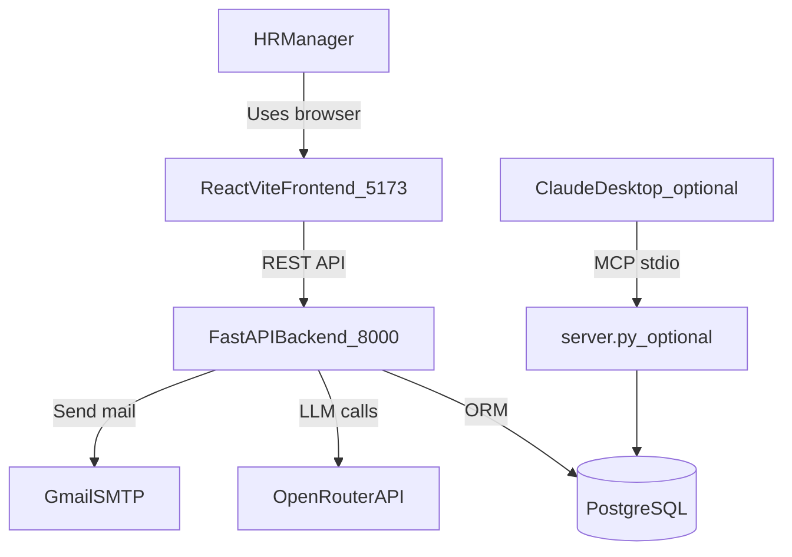

# HR-ASSIST: Agentic AI for HR Automation


> **An AI-powered HR automation platform with a FastAPI + React web app, OpenRouter-based LLM chat, PostgreSQL persistence, and optional MCP integration for Claude Desktop.**

---

## Overview

**HR-ASSIST** provides a local web application for HR/admin and employee workflows, backed by PostgreSQL and an OpenRouter-powered assistant that can execute HR tools (onboarding, leave, ticketing, scheduling) from natural language.  


### The Problem
HR managers spend hours toggling between HRMS software, email clients, and ticketing systems to onboard a single employee.

### The Solution
A unified interface where natural language turns into action.
* **Input:** *"Onboard Ruchitha as a Data Analyst."*
* **Output:** Employee record created + Welcome email sent + IT ticket raised + Orientation meeting scheduled.

---

## Key Features

| Feature                | Description |
|:-----------------------|:---|
| **MCP Prompts**        | Pre-configured templates (UI forms) for complex tasks like onboarding. |
| **PostgreSQL Backend** | Persistent storage via SQLAlchemy ORM — data survives server restarts. |
| **HRMS Integration**   | Tool execution to search, add, and manage employee records. |
| **Ticket Management**  | Auto-generation of IT support tickets. |
| **Intelligent Calendar** | Natural language date parsing for meeting management. |

---

## Technical Architecture



### Tech Stack

* **Language:** Python 3.10+
* **Web Backend:** FastAPI + Uvicorn
* **Frontend:** React + Vite
* **LLM Provider:** OpenRouter
* **Optional Protocol:** Model Context Protocol (MCP) for Claude Desktop integration
* **Database:** PostgreSQL + SQLAlchemy ORM
* **Driver:** psycopg2-binary (macOS compatible)
* **Dependency Management:** `uv`
* **Libraries:** `fastmcp`, `pydantic`, `python-dotenv`, `sqlalchemy`

---

## Repository Structure

This repo has **two runtime modes** over a shared HR domain:

1. **Web app mode** (FastAPI + React): HR/admin and employee portal on localhost.
2. **MCP mode** (`server.py`): tool server for Claude Desktop integrations.

```text
smart-onboarding-assistant/
├── app/                      # FastAPI web backend (HTTP APIs, auth, routers)
├── frontend/                 # React + Vite frontend (HR and employee dashboards)
├── hrms/                     # Core HR domain/business logic used by backend + MCP
├── services/                 # Orchestration workflows (onboarding/chat memory)
├── scripts/                  # Helper scripts to run the project
├── database.py               # SQLAlchemy engine/session bootstrap
├── models.py                 # ORM models/tables (employees, tickets, meetings, etc.)
├── server.py                 # MCP stdio server entrypoint (Claude Desktop flow)
├── emails.py                 # SMTP email sender abstraction
├── .env.example              # Environment variable template
├── pyproject.toml            # Python project metadata and dependencies
└── uv.lock                   # Locked Python dependency graph (uv)
```

### Detailed Folder/File Guide

#### `app/` - FastAPI backend (web app API)

- `app/main.py`  
  Main API entrypoint (`app` object), CORS setup, router registration, and startup wiring.
- `app/routers/portal_auth.py`  
  Employee portal authentication endpoints (login/token/session-oriented routes).
- `app/routers/portal_data.py`  
  Employee-facing portal APIs (profile, requests, dashboard data).
- `app/routers/data_crud.py`  
  Admin/HR CRUD and operational API endpoints.
- `app/schemas.py`, `app/schemas_data.py`  
  Pydantic request/response models for API validation.
- `app/openai_tools.py`, `app/tool_dispatch.py`, `app/openrouter_chat.py`  
  Tool definitions and AI-chat-to-tool execution plumbing.
- `app/auth.py`, `app/auth_jwt.py`, `app/passwords.py`  
  API key/JWT/password hashing utilities for secure access.
- `app/deps.py`, `app/chat_deps.py`, `app/chat_context.py`  
  Dependency injection + chat context resolution for routes/tools.
- `app/db_migrate.py`  
  App startup migration helpers (non-Alembic lightweight migrations).
- `app/dev_seed_employees.py`, `app/portal_seed.py`  
  Development seed logic for bootstrapping demo/portal users.

#### `frontend/` - React UI

- `frontend/src/main.tsx`  
  Frontend bootstrapping entrypoint.
- `frontend/src/App.tsx`  
  Application shell and route-level composition.
- `frontend/src/components/HrDashboard.tsx`  
  HR-facing dashboard for onboarding/operations.
- `frontend/src/components/EmployeeDashboard.tsx`  
  Employee-facing dashboard and self-service flows.
- `frontend/src/components/OnboardingWizard.tsx`  
  Guided onboarding form/workflow in the UI.
- `frontend/src/components/DataConsole.tsx`  
  Data/admin utility surface in the frontend.
- `frontend/src/context/PortalSessionContext.tsx`  
  Frontend auth/session context provider.
- `frontend/package.json`  
  Frontend scripts and JS dependencies (`npm run dev`, `npm run build`).

#### `hrms/` - Core domain layer

This folder contains reusable HR business logic that both runtime modes rely on.

- `hrms/employee_manager.py` - employee management operations
- `hrms/leave_manager.py`, `hrms/leave_request_service.py` - leave balance and requests
- `hrms/meeting_manager.py` - meeting scheduling/query logic
- `hrms/ticket_manager.py`, `hrms/ticket_notifications.py` - IT ticket lifecycle + notifications
- `hrms/manager_manager.py`, `hrms/data_admin_service.py` - manager roster/admin workflows
- `hrms/tools_impl.py` - shared implementation used by MCP tools and API tool dispatch
- `hrms/atom_email.py` - work-email normalization/generation helpers
- `hrms/schemas.py` - domain-level schema objects

#### `services/` - workflow orchestrators

- `services/onboarding_service.py`  
  Higher-level onboarding orchestration combining HRMS logic + notifications + meeting/ticket flows.
- `services/chat_memory.py`  
  Chat memory/state support for conversational flows.

#### Root-level infrastructure files

- `database.py`  
  Creates SQLAlchemy engine/session factory used across app modules.
- `models.py`  
  Table definitions and relationships for PostgreSQL persistence.
- `emails.py`  
  SMTP mail sender used by onboarding/ticket notifications.
- `server.py`  
  MCP tool server (stdio transport) for Claude Desktop, independent of the web frontend.
- `.env.example`  
  Reference env vars for DB, CORS, SMTP, API keys, and local run commands.
- `scripts/run-web.sh`  
  Convenience script to run web components quickly.

---

## Setup & Installation

### 1. Create the PostgreSQL Database

```bash
# Start PostgreSQL (Homebrew)
brew services start postgresql

# Create the database
createdb hrms_db
```

### 2. Clone & Install Dependencies

```bash
git clone https://github.com/YOUR_USERNAME/hr-assist-mcp-agent.git
cd hr-assist-mcp-agent

uv sync
```

### 3. Configure Environment

Create a `.env` file:

```env
# PostgreSQL — replace YOUR_MAC_USERNAME with your macOS username
DATABASE_URL=postgresql://YOUR_MAC_USERNAME@localhost:5432/hrms_db

# Gmail SMTP
CB_EMAIL=your_email@gmail.com
CB_EMAIL_PWD=your_app_password
```

> **Tip (Homebrew PostgreSQL):** Your username is usually your macOS system username. No password is required by default.

### 4. Configure OpenRouter (required for chat endpoints)

Add to `.env`:

```env
OPENROUTER_API_KEY=your_openrouter_api_key
# Optional overrides:
# OPENROUTER_MODEL=openai/gpt-4o-mini
# OPENROUTER_BASE_URL=https://openrouter.ai/api/v1
# OPENROUTER_HTTP_REFERER=http://localhost:5173
# OPENROUTER_TITLE=HR-ASSIST
```

### 5. Run the web app (primary mode)

Start backend:

```bash
uv run python -m uvicorn app.main:app --reload --host 0.0.0.0 --port 8000
```

In another terminal, start frontend:

```bash
cd frontend
npm install
npm run dev
```

Open `http://localhost:5173`.

### 6. Connect to Claude Desktop (optional MCP mode)

Add to your `claude_desktop_config.json`:

```json
{
  "mcpServers": {
    "hr-assist": {
      "command": "uv",
      "args": ["--directory", "/ABSOLUTE/PATH/TO/PROJECT", "run", "server.py"],
      "env": {
        "DATABASE_URL": "postgresql://YOUR_MAC_USERNAME@localhost:5432/hrms_db",
        "CB_EMAIL": "your_email@gmail.com",
        "CB_EMAIL_PWD": "your_app_password"
      }
    }
  }
}
```

> **Note:** Web app mode does not require Claude Desktop. Use MCP mode only if you want tool access from Claude Desktop.

---

## Usage Guide

### Method 1: Natural Language

> "Schedule a meeting for employee E001 tomorrow at 10 AM regarding Project Kickoff."

### Method 2: MCP Prompt Templates (Recommended)

1. Click the **Attach** button or type `/` in Claude Desktop.
2. Select **`onboard_new_employee`**.
3. Fill in the fields:
   * **Employee Name:** `Ruchitha`
   * **Manager Name:** `Sarah`
4. Hit **Run**. The agent executes the entire workflow automatically.

---

## Database Schema

| Table            | Key Columns |
|:-----------------|:---|
| `employees`      | emp_id (PK), name, manager_id (FK→self), email |
| `leave_balances` | emp_id (FK), balance |
| `leave_history`  | id, emp_id (FK), leave_date, request_id |
| `meetings`       | id, emp_id (FK), meeting_dt, topic |
| `tickets`        | ticket_id (PK), emp_id (FK), item, reason, status, created_at, updated_at |

---

## Bug Fixes (v0.2.0)

- **Leave history format** — leave dates are now consistently stored as `date` objects in the DB, preventing crashes from mixed string/date types.
- **Meetings schema mismatch** — all meetings now share a single unified schema; the old inconsistency between seeded and user-created meetings is resolved.
- **`list_tickets` optional params** — `employee_id` and `status` are now correctly optional filters.
- **`utils.py` removed** — in-memory seeding is no longer needed; the DB starts empty and persists all data across restarts.